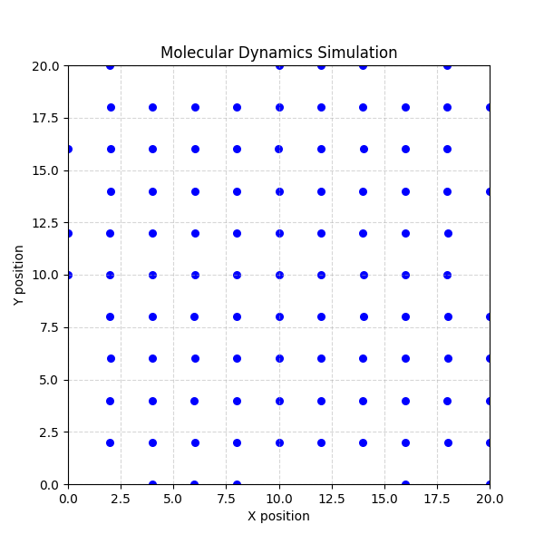
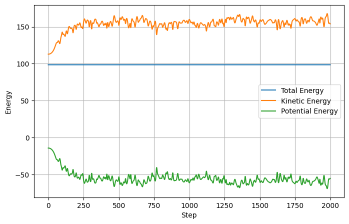
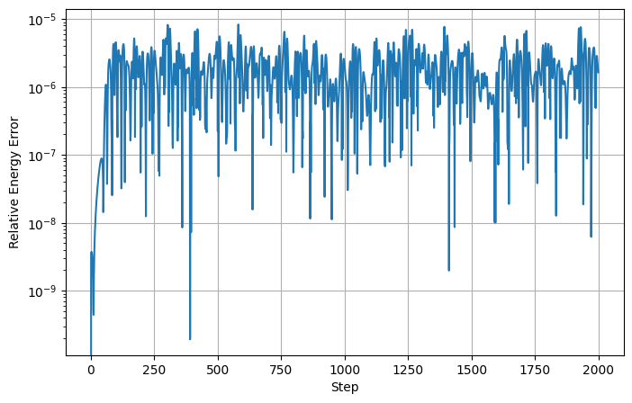

# Molecular Dynamics Simulation Using the Lennard Jones Potential

# Description

This project implements a two dimensional Molecular Dynamics simulation of interacting particles using the Lennard Jones potential.

Particles are initialized inside a square simulation box and evolved using the Velocity Verlet integration method. Periodic boundary conditions are applied to mimic an infinite system, while pairwise interactions are calculated using the minimum image convention.

The simulation tracks particle trajectories, kinetic energy, potential energy, and total energy throughout the evolution. Energy conservation is verified 
for the dynamics.

The project demonstrates numerical integration of many body systems, implementation of interparticle potentials, periodic boundary condition.

# Features

- Velocity Verlet integration method
- Lennard Jones particle interactions
- Periodic boundary conditions
- Minimum image convention
- Maxwell Boltzmann velocity initialization
- Energy conservation verification
- Particle trajectory tracking
- Animated Molecular Dynamics visualization
- Kinetic, potential, and total energy analysis

# Simulated Physical System

The interaction between particles is described by the Lennard Jones potential

V(r) = 4ε((σ/r)^12 − (σ/r)^6)

where

- r is the distance between two particles
- ε determines the interaction strength
- σ determines the characteristic particle size

The first term represents short range repulsion that prevents particle overlap.

The second term represents longer range attraction between particles.

The force between two particles is

F(r) = 24ε(2(σ/r)^12 − (σ/r)^6)(ri − rj)/r²

At short distances the repulsive interaction dominates, while at larger distances the attractive interaction becomes important.

# Workflow

1. Define the number of particles, box size, timestep, and simulation duration.

2. Initialize particle positions on a lattice inside the simulation box.

3. Assign particle velocities from a Maxwell Boltzmann distribution and remove center of mass drift.

4. Compute pairwise particle separations using the minimum image convention.

5. Calculate Lennard Jones forces acting on every particle.

6. Update particle positions and velocities using the Velocity Verlet algorithm.

7. Apply periodic boundary conditions after each timestep.

8. Store particle positions for trajectory visualization and animation.

9. Compute kinetic energy, potential energy, and total energy throughout the simulation.

10. Verify energy conservation by calculating the relative energy error.

11. Generate energy plots and animated particle trajectories.

# Results

Initial Configuration

The figure below shows the initial particle arrangement used in the simulation.

Particles are placed on a lattice inside the simulation box and assigned velocities sampled from a Maxwell Boltzmann distribution.

Particle Dynamics

The gif below shows the evolution of the Molecular Dynamics simulation.

The simulation exhibits both attractive and repulsive interactions while maintaining energy conservation.

Energy Evolution

The plot below shows the kinetic energy, potential energy, and total energy of the system.

The exchange between kinetic and potential energy is clearly visible, while the total energy remains approximately constant.

Energy Conservation

The relative energy error remains small throughout the simulation, demonstrating the stability and accuracy of the Velocity Verlet integration scheme.

Files

md_simulation.py

results/

- md_simulation.gif
- initial_configuration.png
- final_configuration.png
- energy_plot.png
- energy_error.png

requirements.txt

README.md

The simulation was developed using NumPy and Matplotlib without relying on specialized Molecular Dynamics software.
